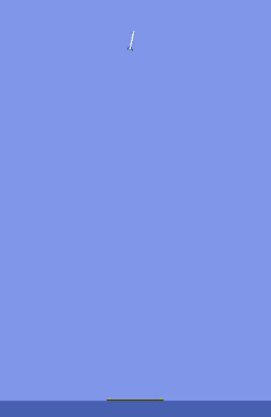
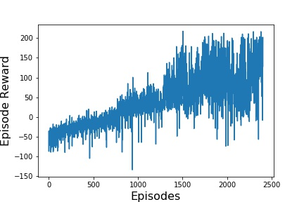
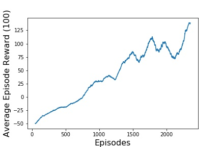
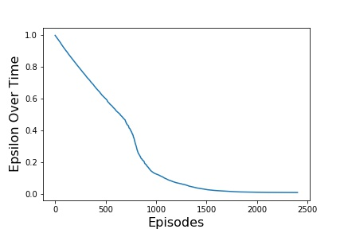
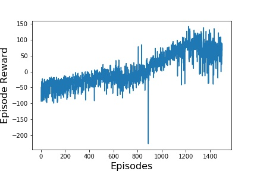
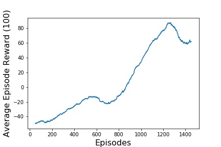
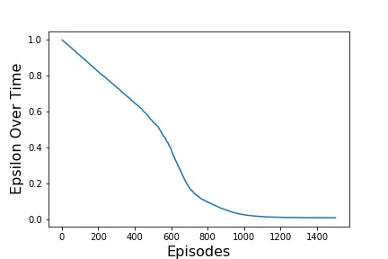
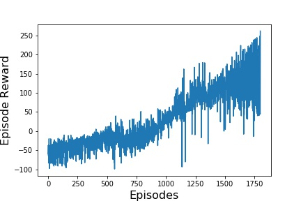
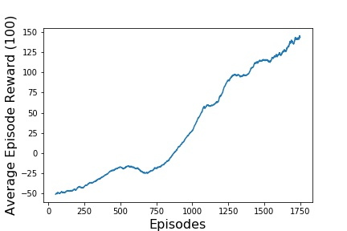
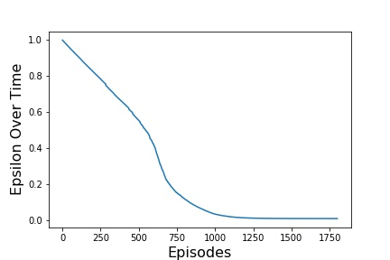

Introduction
============

The goal of this project is to study and implement a Reinforcement Learning algorithm in order to solve several games from the Gym Toolkit. The algorithm chosen is called Deep Q Learning, and uses a Deep Neural Network to learn the Q Function. Besides the implementation, also some improvements are tried with Double Deep Q Learning and Prioritized Experience Replay in order to improve performance. The source code for this project can be accessed from my [GitHub page](https://github.com/ibiscp/Rocket-Lander).

Description of the problem
==========================

Besides the idea is to develop an algorithm that can be used for more than one game, this report will contain only the solution for the environment called ’Rocket Landing’, which is inspired on SpaceX idea of reusable rockets.

 
<i>Simulator screenshot</i>

The rocket starts from a high altitude, out of the screen, as shown in image above, and the goal is to control it using the thrusters in order to land it on a drone on the sea. The landing also needs to occur smoothly in order to avoid demaging to the rocket legs.

Formal model of the problem
===========================

To control the rocket it is necessary to give to the learning algorithm the actual state of the problem, called state variables and take one of the actions from the control inputs. After every iteration, which is a frame of the simulation, an action will be calculated and a result of that action will be returned to the algorithm as a reward and the result state.

State variables
---------------

For the state variables, it is possible to limit the number of variables used for the training, however, it was decided to use all the data available in order to have a better control of the rocket.

-   x position

-   y position

-   angle

-   first leg ground contact indicator

-   second leg ground contact indicator

-   throttle

-   engine gimbal

-   x velocity

-   y velocity

-   angular velocity

Control inputs
--------------

Using this simulator, it is possible to choose one of the two types of controls, or discrete or continuous. It was decided to use discrete control because the same code could be used in a bigger variety of other simulators inside Gym.

-   gimbal left

-   gimbal right

-   throttle up

-   throttle down

-   use first control thruster

-   use second control thruster

-   no action

Reward function
---------------

The reward function of this environment involves a series of variables, such as rocket’s speed, distance to the goal, angle, angular velocity, fuel, ground contact and some other variables. It is only interesting to cite that the reward value improves as the rocket gets closer to the goal.

Solution algorithm
==================

A algorithm well-known is the Q Learning, which has the goal of finding a sequence of actions from some state that leads to a reward. Some actions may lead to a greater reward, others may achieve the goal faster.

The original Q Learning algorithm uses a table $Q(s,a)$, composed of rows of states and columns of actions. It uses the Bellman equation, which states that the expected long-term reward for a given action is equal to the immediate reward from the current action combined with the expected reward from the best future action taken at the following state.

$$Q(s,a)=r+\gamma(r_1+\gamma r_2+\gamma^2 r_3+...)=r+\gamma max_a Q(s',a)$$

In the case of this problem, because the states are constant, it is not possible to use a table, and it is substituted by a neural network. So the goal is to update the weights of the neural network, but it follows the same equation and the same process.

Hyperparameters
---------------

The hyperparameters used for this project are presented in the table below:

|**Parameter**|**Value**|
|---|---|
|\Gamma (reward discount factor)|0.99|
|learning rate|0.00025|
|target update (episodes)|1000|
|\epsilon start|1.0|
|\epsilon end|0.01|
|\epsilon decay|0.0001|
|batch size|128|
|memory capacity|200000|

Exploration and exploitation
----------------------------

The way the algorithm chooses the action is called policy. A variable $\epsilon$ is used in order to help with this decision, at the beginning it is important to chose random actions in order to get a better feeling about exactly what is the response of the system given an action, it is called exploration. As the iterations pass this $\epsilon$ decreases in order to fine-tune the parameters (exploitation).

Experience replay
-----------------

It was acknowledged by the authors of the original paper that using only a neural network to represent the Q function make it unstable.

When using online learning from each simulation step the problem is that the samples feed to the neural network are highly correlated, so the network will most likely over fit and fail to generalize properly.

The solution found is to store the last $n$ experiences in a memory and instead of training the network with only one sample use a random batch from this memory.

Target network
--------------

As written before, the formula for setting targets for gradient descent is:

$$Q(s,a)=r+\gamma max_a Q(s',a)$$

One improvement that was implemented after some initial tests is the called target network, which is composed of two neural networks with the same structure, but the target network is frozen in time and provide stable $Q^*$ values and allows the algorithm to converge to the specified target.

$$Q(s,a)=r+\gamma max_a Q^*(s',a)$$

It is necessary because as the states $s$ and $s'$ are too close to each other, at each update the target shifts a little bit, not allowing the algorithm to converge to any value. This way, the target network is update at each 1000 steps, which is a value large enough so the algorithm can converge.

A problem of this method is that it slow down the learning process. A change in the $Q$ function is propagated only after the target network is update. However, besides sacrificing speed, it adds stability and allows the algorithm to learn correct behaviour in much more complicated algorithms.

Double learning
---------------

One problem of DQN algorithm is presented in [@doubleQLearning] and states that the agent tends to overestimate the Q function value, due to the $max$ in the formula. The problem is that for a given state where all the actions have the same true Q value, but the estimate is inherently noisy, the value with the highest positive error is selected and subsequently propagated further to other states. This leads to positive bias (value overestimation) and it severely impacts on stability of the learning algorithm.

The solution proposed is to use two separate Q functions, one function is then used to determine the maximizing action and second to estimate its value. In this algorithm because the target network is being used, $Q^*$ is not completely independent of $Q$, however, it can be used to avoid this problem, changing the formula to:

$$Q(s,a)=r+\gamma Q^*(s', argmax_a Q(s',a))$$

Besides the Double Deep Q Network (DDQN) does not always improve performance, it benefits the stability of learning, which means that it can learn much more complicated tasks.

Prioritize experience replay
----------------------------

Another improvement also possible is to change the way the memory is used to generate the batches to train, instead of generating a random batch, it is possible to select those samples that it can learn more with [@prioritizedExperienceReplay].

In order to attribute a value for the samples, it is necessary to calculate an error between the $Q(s,a)$ and its target $T(S)$:

$$error=|Q(s,a)-T(S)|$$

Where $T$ is defined as:

$$T(S)=r+\gamma Q^*(s', argmax_a Q(s',a))$$

After having the error, it is necessary to convert this error to priority and then save in the memory with every sample, which is updated whitin each learning step. In order to calculate the priority of each sample it is used the following formula:

$$p = (error + \epsilon)^\alpha$$

The values $\epsilon$ and $\alpha$ of this formula are constant values. The value $\epsilon$ is a small number only to ensure that no transition has zero probability. And $\alpha$, can be a value between $0$ and $1$, controls the difference between high and low error.

Implementation
==============

The algorithm here described is divided in tree different parts, the memory, the brain and the agent. Each one has its own well defined role and it is divided in different classes in order to keep the code organized and modularized.

Memory
------

The memory is necessary to keep in memory a certain number of last actions executed by the agent. It is necessary to store the experience that will be used for Experience Replay.

Each experience saved to the memory have the following information:

-   priority

-   current state

-   action

-   reward

-   next state

Brain
-----

The Brain class encapsulates the Neural Network. It is defined with [2]{} hidden layers with [512]{} neurons each and ReLU activation function. The input number of neurons is the number of states and the output number of neuros is the number of possible actions.

For the loss it is using the Huber loss function, it is a loss function used in robust regression that is less sensitive to outliers in data than the squared error loss.

Agent
-----

The Agent class is a container that encapsulates all the methods for the algorithm to run, such as the act, observe, replay and epsilon reduction.

Also some higher level tasks are also implemented like save and load model, which enables the script to stop training and resume it from where it stopped.

Results
=======

For the results, three different data for each of the simulations made will be presented. The first graph presents the evolution of rewards over the training. The second graph, shows an average of the reward over 100 episodes in order to better visualize the evolution. And lastly, in the third graph, the $\epsilon$ decay over time in order to show de
evolution starting with completely exploration and finishing with exploitation.

The first simulation made was using only a simple Q Learning, and the result is presented in image below.

 
<i>Deep Q Network</i>

Second, after adding the Target Network to the DQN, presented in image below.

 
<i>Target Deep Q Network</i>

And lastly the complete Double Deep Q Network with, presented in image below.

 
<i>Double Deep Q Network</i>

It is possible to notice that on every graph the reward is improving over time, which means that the Neural Networking is learning how to play the game.

Conclusions
===========

It was really interesting to see and implement the evolution of published papers in this field, starting with a simple Deep Q Learning, then implementing Experience Replay, using Target Network, Double Deep Q Learning and finally implementing Prioritize Experience Replay.

Because this algorithm works for a variety of different Gym environments, it is not clear that every step implemented improved the learning for all environments, but overall it certainly improved performance.

A future work that can be the next step for this project is to modify the neural network in order to improve its performance for other environments and also find a way to improve the speed of learning.